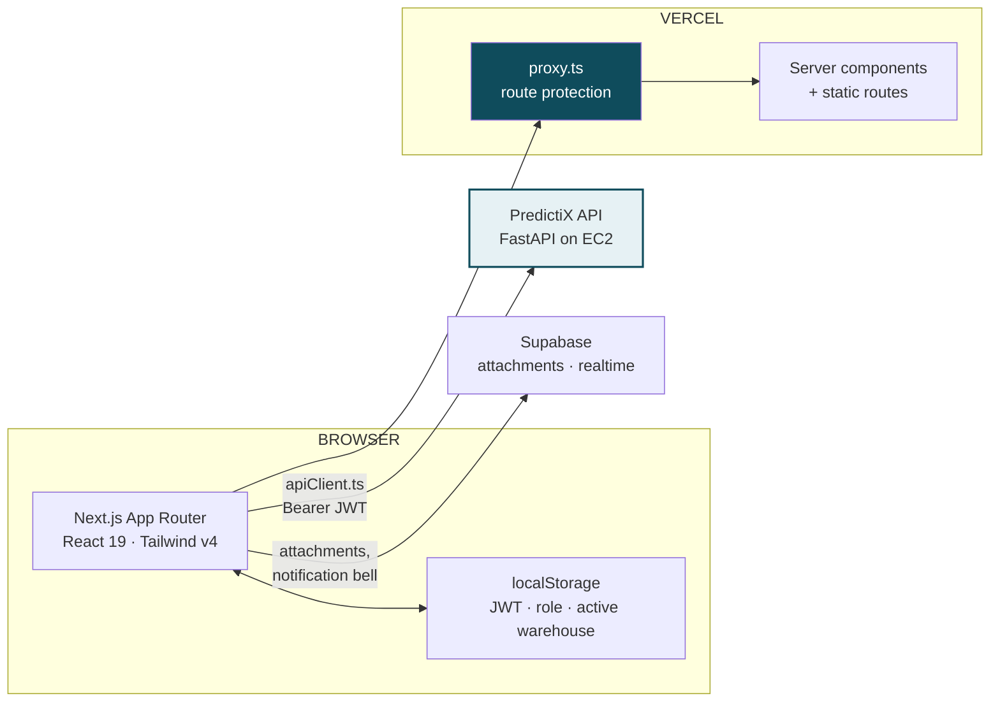
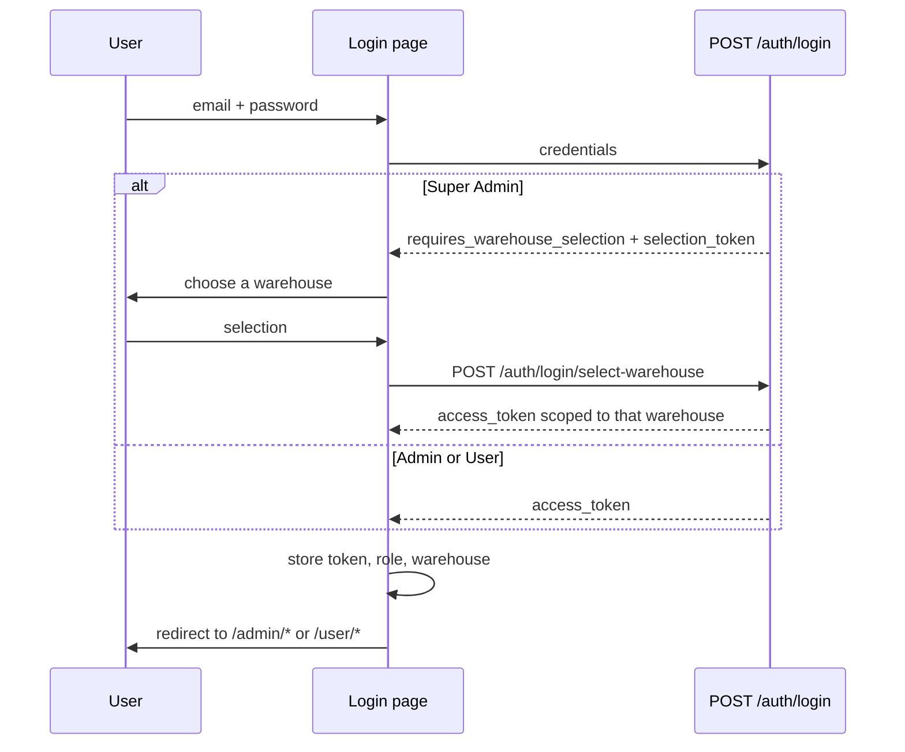

# PredictiX — Frontend


> AI-powered predictive maintenance and fleet/asset management dashboard for industrial operations.

PredictiX is a role-based Next.js web application for fleet operations and maintenance teams. It surfaces AI-generated failure predictions, cost forecasts, component RUL (remaining useful life) estimates, and health scores from the PredictiX backend, alongside asset management, a ticketing system with AI categorisation/prioritisation, warehouse operations, and an AI chatbot — all behind role-based access control (User / Admin / Super Admin).

---

## Live Deployment

| Environment | URL |
|---|---|
| Production | [predicti-x-frontend.vercel.app](https://predicti-x-frontend.vercel.app) |
| Preview | [predicti-x-frontend-dinusha-ekanayakes-projects.vercel.app](https://predicti-x-frontend-dinusha-ekanayakes-projects.vercel.app) |

Deployed on Vercel, connected to the repository — every push builds a preview, and `main`
promotes to production. The API host is supplied at build time as `NEXT_PUBLIC_API_URL`; it is
never committed. The companion API lives in the [`PredictiX_Backend`](../predictix_backend) repository.

---

## Table of Contents

- [Live Deployment](#live-deployment)
- [Overview](#overview)
- [Tech Stack](#tech-stack)
- [Project Structure](#project-structure)
- [Features](#features)
- [Routes & Pages](#routes--pages)
- [Authentication & Authorization](#authentication--authorization)
- [API Integration](#api-integration)
- [Local Dev Backend Proxy](#local-dev-backend-proxy)
- [Loading States](#loading-states)
- [State Management](#state-management)
- [Getting Started](#getting-started)
- [Environment Variables](#environment-variables)
- [Component Architecture](#component-architecture)
- [Theming](#theming)
- [Testing](#testing)
- [Scripts](#scripts)

---

## Overview

PredictiX serves three roles, each with a distinct layout and route group:

- **User** — self-service: view assigned assets, browse/search the full fleet read-only, raise and track maintenance tickets, manage their own profile.
- **Admin** — full CRUD over assets, tickets, and users within their own warehouse; the admin operations dashboard; warehouse reports.
- **Super Admin** — the same admin capabilities as Admin, but selects which warehouse to operate in at login (a two-step login flow), and can switch between warehouses.

All fleet-wide and warehouse-scoped data the backend serves is automatically scoped to the caller's active warehouse — a regular Admin always sees their own warehouse; a Super Admin sees whichever warehouse they selected at login.

### Where the app sits



### Login and role routing

Super Admins choose a warehouse before they receive a usable token, so a two-step exchange
exists on that path only.



---

## Tech Stack

| Layer | Technology |
|---|---|
| Framework | Next.js 16 (App Router, Turbopack) |
| Language | TypeScript 5 |
| UI Library | React 19 |
| Styling | Tailwind CSS v4 + Radix UI (via `radix-ui` + `@radix-ui/react-*`) |
| Charts | Recharts |
| Auth backend | Custom JWT (`POST /auth/login`) issued by the PredictiX FastAPI backend |
| Realtime / Storage | Supabase (`@supabase/supabase-js`) — ticket attachments, realtime notification bell |
| Notifications (toast) | Sonner |
| Theme | next-themes (light/dark, system-aware) |
| PDF Export | html2pdf.js |
| Icons | lucide-react |
| Compiler | React Compiler (`babel-plugin-react-compiler`) |
| Linting | ESLint 9 (flat config, `eslint-config-next`) |
| Node | 18+ (20 LTS recommended) |

---

## Project Structure

```
predictix_frontend/
├── public/                              # Static assets (logo, icons)
└── src/
    ├── app/                             # Next.js App Router
    │   ├── (admin)/admin/
    │   │   ├── layout.tsx               # Admin layout: navbar + AuthGuard
    │   │   ├── dashboard/                # Admin operations dashboard
    │   │   ├── assets/                   # Paginated asset inventory + detail panel
    │   │   ├── tickets/                  # Ticket management (list, filters, dialogs)
    │   │   ├── users/                    # User management CRUD
    │   │   ├── profile/                  # Admin's own profile
    │   │   ├── settings/                 # Admin account settings
    │   │   └── warehouse/                # Warehouse ops + AI report generation
    │   │       └── report/               # AI-generated warehouse report + PDF export
    │   ├── (auth)/login/
    │   │   ├── page.tsx                  # Email/password login (+ 2-step super_admin warehouse pick)
    │   │   └── callback/                 # OAuth callback handler
    │   ├── (user)/user/
    │   │   ├── layout.tsx                # User layout: navbar + AuthGuard
    │   │   ├── dashboard/                 # User dashboard (assigned assets, team, stats)
    │   │   ├── assets/                    # My assigned assets + read-only fleet search
    │   │   ├── tickets/                   # Raise / track my tickets
    │   │   ├── users/                     # Read-only team directory
    │   │   ├── profile/                   # My profile
    │   │   └── settings/                  # My account settings
    │   ├── api/
    │   │   ├── proxy/[...path]/          # Local-dev-only backend reverse proxy (see below)
    │   │   └── proxy-port/               # Reports/clears the auto-detected backend port
    │   ├── help-desk/                    # Help & support page
    │   ├── privacy-policy/, terms-of-service/
    │   ├── test-loader/, theme-preview/  # Internal dev/QA preview pages
    │   ├── layout.tsx                    # Root layout (ThemeProvider, fonts, toaster)
    │   ├── page.tsx                      # Root → redirects to /login
    │   └── globals.css                   # Global styles, CSS variables, keyframes
    ├── components/
    │   ├── admin/
    │   │   ├── assets/                   # AssetsTable, AssetsToolbar, AssetsSummary,
    │   │   │                             #   AssetsAnalytics, AssetDetailsPanel, AssetFormDialog
    │   │   ├── dashboard/                # KPI cards, charts, alerts, AI insights
    │   │   ├── dialogs/                  # NewTicketDialog, TicketDetailsDialog, etc.
    │   │   ├── users/                    # AddUserDialog, EditUserDialog, ViewUserDetailsDialog…
    │   │   ├── warehouse/                # Warehouse cards, schedule, AI report modal
    │   │   └── common/                   # Shared stat cards / section cards
    │   ├── user/
    │   │   ├── assets/                   # User-facing asset detail dialog
    │   │   ├── tickets/                  # User ticket dialogs
    │   │   └── users/, dialogs/          # Team view, user-role dialogs
    │   ├── auth/
    │   │   ├── AuthGuard.tsx             # Role-aware client route protection + branded loader
    │   │   ├── RouteGuard.tsx            # Lower-level auth/redirect guard
    │   │   └── RoleSelectCards.tsx       # Legacy role-picker UI
    │   ├── navigation/
    │   │   ├── AdminNavbar.tsx / UserNavbar.tsx
    │   │   ├── NotificationBell.tsx      # Realtime (Supabase/WS) notification dropdown
    │   │   └── useNavRouter.ts
    │   ├── chat/
    │   │   └── FloatingChatbot.tsx       # Draggable AI chatbot widget (all pages)
    │   ├── theme/                        # ThemeProvider, ThemeToggle
    │   ├── background/                   # AntigravityDotsBackground, ambient effects
    │   ├── loading/
    │   │   └── PredictiXLoader.tsx       # Branded loading screen (progress + stage aware)
    │   ├── brand/                        # PredictiXLogo
    │   └── ui/                           # shadcn/ui-style base primitives
    ├── hooks/
    │   ├── useAuth.ts                    # Auth check + role-based redirect
    │   └── useMinDelay.ts                # Minimum-visible-time for loading screens
    ├── lib/
    │   ├── authService.ts                # login/selectWarehouse, session storage, HF Space warmup ping
    │   ├── apiClient.ts                  # Authenticated fetch wrapper (apiGet/Post/Put/Delete)
    │   ├── backendScanner.ts             # Auto-detects the live backend port for the dev proxy
    │   ├── supabaseBrowserClient.ts      # Supabase client (attachments, realtime)
    │   ├── userService.ts, ticketService.ts, warehouseService.ts, dashboardService.ts
    │   ├── assetPdfExport.ts, pdfExport.ts, professionalPdfExport.ts
    │   ├── utils.ts                      # cn() and misc utilities
    │   └── api/
    │       ├── assets.ts, userProfileApi.ts, userTickets.ts, notificationsApi.ts
    └── (no middleware.ts — route protection is client-side only; see below)
```

---

## Features

### Asset Management
- Server-side paginated asset list (50/page) with search, status, health-band, and warehouse filters.
- Fleet-wide summary KPIs and descriptive analytics (status/health/vehicle-type distributions, top-at-risk assets) computed by the backend, not derived from the current page.
- Per-asset detail panel: failure probability, cost estimate, component RUL (remaining useful life, computed per-asset from sensor history — independent of the warehouse survival-analysis models), maintenance history, tickets, assignments.
- Create/edit asset dialog with the real backend status enum (`active`, `inactive`, `under_maintenance`, `critical`, `decommissioned`).

### Predictive Maintenance (ML)
- Failure probability, risk level, and predicted maintenance date per asset (CatBoost classifier + regressor on the backend).
- Cost forecasting (LKR) with min/max range.
- Component-level RUL estimation from linear-trend extrapolation over sensor history.

### Smart Maintenance Tickets
- AI-powered ticket categorisation and priority suggestion (admin can adjust; user's priority is AI-locked).
- Full ticket lifecycle: open → in-progress → resolved → closed, with comments and attachments.
- Admin ticket management with filters, search, and bulk visibility; user-facing raise/track flow.

### Notifications
- Realtime notification bell (Supabase/WebSocket-backed) with unread counts and mark-as-read.
- Per-user notification preferences.

### Warehouse Operations
- Multi-warehouse overview, predictive maintenance schedule, AI-generated warehouse insight cards.
- AI-generated warehouse report (Groq-backed RAG) with PDF export.

### AI Chatbot
- Floating, draggable chat widget available on every page, position persisted to `localStorage`.
- Talks to the backend's `/chatbot/*` routes (same origin as the main API — no separate service).

### Role-Based Access Control
- Three roles (User / Admin / Super Admin) with distinct route groups, layouts, and navbars.
- Route protection is enforced client-side via `AuthGuard`/`RouteGuard` + `useAuth()` — there is **no `middleware.ts`** in this app.

---

## Routes & Pages

| Route | Access | Description |
|---|---|---|
| `/` | Public | Redirects to `/login` |
| `/login` | Public | Email/password login; 2-step warehouse selection for Super Admin |
| `/login/callback` | Public | OAuth callback handler |
| `/admin/dashboard` | Admin | Operations dashboard: KPIs, charts, alerts, latest tickets, AI summary |
| `/admin/assets` | Admin | Paginated asset inventory, filters, analytics, detail panel |
| `/admin/tickets` | Admin | Ticket list, filters, create/detail dialogs |
| `/admin/users` | Admin | User management: create, edit, assign roles/warehouse, view assigned assets |
| `/admin/profile` / `/admin/settings` | Admin | Admin's own profile and account settings |
| `/admin/warehouse` | Admin | Warehouse overview, maintenance schedule, AI insights |
| `/admin/warehouse/report` | Admin | AI-generated warehouse report with PDF export |
| `/user/dashboard` | User | Assigned assets, team, personal stats |
| `/user/assets` | User | My assigned assets + read-only searchable fleet |
| `/user/tickets` | User | Raise and track my tickets |
| `/user/users` | User | Read-only team directory |
| `/user/profile` / `/user/settings` | User | My profile and account settings |
| `/help-desk` | All | Help and support page |
| `/privacy-policy`, `/terms-of-service` | Public | Static legal pages |

Every page above has a matching `loading.tsx` using the shared `PredictiXLoader`, so route transitions and first-load client fetches both show a consistent branded loading state.

---

## Authentication & Authorization

### Login Flow
1. User submits email + password to `POST /auth/login`.
2. **User / Admin**: the backend returns a JWT immediately (`access_token`, `role`, `warehouse_id`, …) — login is complete in one step.
3. **Super Admin**: the backend responds with `requires_warehouse_selection: true` plus a short-lived `selection_token` and the list of warehouses. The UI shows a second step to pick a warehouse, then calls `POST /auth/login/select-warehouse` to exchange the selection for the real JWT.
4. The JWT and a normalised user object are stored in `localStorage` and attached to every subsequent API call.

### Storage Keys
| Key | Content |
|---|---|
| `predictix.access_token` | JWT bearer token |
| `predictix.user` | Serialised user object (id, email, role, full_name, warehouse_id, warehouse_name) |

### Route Protection
- **Client-side only** — `AuthGuard` (role-aware, shows the branded loader while checking) and `RouteGuard` wrap the admin/user layouts; `useAuth()` handles redirect logic. There is no server-side `middleware.ts`.
- A `401` from any API call triggers logout + redirect to `/login`.

### HF Inference Space Warmup
The login page fires a fire-and-forget `POST /warmup/inference-space` on mount, waking the backend's Gradio-hosted ticket categorisation/priority model before the user even logs in, so it's warm by the time they raise their first ticket.

---

## API Integration

The frontend talks to a **single** backend origin (`NEXT_PUBLIC_API_URL`) for everything, including the chatbot — there is no separate chatbot microservice/port.

### API Client (`src/lib/apiClient.ts`)

```ts
apiGet<T>(path: string): Promise<T>
apiPost<T>(path: string, body: unknown): Promise<T>
apiPut<T>(path: string, body: unknown): Promise<T>
apiDelete<T>(path: string): Promise<T>
apiFetch(path: string, init?: RequestInit): Promise<Response>   // low-level, for file uploads etc.
askChatbot(message: string): Promise<string>
```

All methods attach `Authorization: Bearer <token>` automatically from `localStorage`. A `401` response triggers logout.

### Representative endpoints consumed

| Area | Endpoint(s) |
|---|---|
| Auth | `POST /auth/login`, `POST /auth/login/select-warehouse` |
| Assets | `GET /assets/` (paginated), `GET /assets/count`, `GET /assets/stats`, `GET /assets/analytics`, `GET /assets/{id}`, `GET /assets/{id}/component-rul` |
| Predictions | `GET /predictions/failure/{id}`, `GET /predictions/cost/{id}`, `POST /vehicle-predictions/{id}` |
| Tickets | `GET/POST /tickets/`, `GET /tickets/status-counts`, `GET/PUT /user/tickets/*` |
| Users | `GET/POST/PUT /users/`, `GET /users/{id}/assets` |
| Warehouses | `GET /warehouses/` |
| Notifications | `GET /notifications/`, `PUT /notifications/{id}/mark-read` |
| Dashboard | `GET /admin-dashboard/summary` |
| Chatbot | `POST /chatbot/ask`, `POST /chatbot/agent` |
| Warmup | `POST /warmup/inference-space` |

---

## Local Dev Backend Proxy

`src/app/api/proxy/[...path]/route.ts` is an optional local-development convenience: it auto-detects which port the FastAPI backend is currently listening on (`backendScanner.ts` probes a small port range) and transparently forwards requests, so the frontend keeps working even if the backend was restarted on a different port during development. `GET /api/proxy-port` reports (and can clear) the cached port. This proxy is not required in production — `NEXT_PUBLIC_API_URL` is used directly there.

---

## Loading States

- `PredictiXLoader` (`components/loading/`) is the single branded loading component used everywhere — route-level (`loading.tsx` on every page) and client-fetch-level (an `initialLoad` state pattern on pages like Assets/Warehouse ensures the full-page loader stays up until the first client-side fetch completes, not just until the route transition finishes).
- Supports determinate progress (`progress` 0–100) and staged labels (`stages: string[]`), used by `AuthGuard` while it verifies the session.

---

## State Management

No global state library. State is managed at three levels:

| Level | Mechanism | Used For |
|---|---|---|
| Persistent | `localStorage` | JWT token, user object, chatbot widget position |
| Global UI | React Context (`ThemeProvider`) | Light/dark theme |
| Local | `useState` / `useReducer` + short-TTL in-memory caches (e.g. the assets list cache) | Forms, filters, modals, pagination, loading states |

---

## Getting Started

### Prerequisites

- **Node.js** 18+ (20 LTS recommended)
- **npm**
- The PredictiX backend running (default `http://127.0.0.1:8000`) — see the backend README

### Installation

```bash
git clone <repository-url>
cd predictix_frontend
npm install
```

### Development Server

```bash
npm run dev
```

Starts at [http://localhost:3000](http://localhost:3000) using Turbopack.

### Build for Production

```bash
npm run build
npm start
```

### Lint

```bash
npm run lint
```

---

## Environment Variables

Create a `.env.local` file in the project root:

```env
# Backend API base URL (no trailing slash). Chatbot routes live on the same origin.
NEXT_PUBLIC_API_URL=http://127.0.0.1:8000

# WebSocket URL for the realtime notification bell (usually the same host, ws:// scheme)
NEXT_PUBLIC_WS_URL=ws://127.0.0.1:8000

# Optional — only if a separate chatbot origin is ever used instead of /chatbot on the main API
NEXT_PUBLIC_CHATBOT_URL=

# Supabase — used for ticket attachment uploads and realtime features
NEXT_PUBLIC_SUPABASE_URL=https://<project>.supabase.co
NEXT_PUBLIC_SUPABASE_ANON_KEY=<anon-key>
```

All `NEXT_PUBLIC_` variables are exposed to the browser bundle. Never put secrets (service-role keys, etc.) behind a `NEXT_PUBLIC_` prefix.

---

## Component Architecture

### Admin Dashboard
| Component | Purpose |
|---|---|
| KPI cards | Total Assets, Critical Alerts, Open Tickets, Fleet Health, Predicted Failures, Maintenance Cost |
| Operational charts | Tabbed Recharts: health trend, ticket volume, cost trend, downtime (scoped/fleet dual-mode) |
| Recent alerts | Severity-badged alert table |
| Latest tickets | Recent ticket list with status/priority |
| AI insights | Rule-based + LLM-backed insight panels |

### Assets
| Component | Purpose |
|---|---|
| `AssetsTable` | Paginated, filterable asset table |
| `AssetsToolbar` | Search + status/health-band/warehouse filters, pagination controls |
| `AssetsSummary` | Fleet-wide KPI cards (server-computed) |
| `AssetsAnalytics` | Status/health/vehicle-type distribution charts + top-at-risk list (server-computed) |
| `AssetDetailsPanel` | Slide-in panel: predictions, cost, component RUL, maintenance history, tickets, assignments |
| `AssetFormDialog` | Create/edit asset form |

### Warehouse
| Component | Purpose |
|---|---|
| Warehouse overview cards, maintenance schedule, asset insights, AI report modal | Multi-warehouse operations and AI-generated PDF reports |

### Floating Chatbot
`FloatingChatbot` is injected into every layout: draggable (position persisted to `localStorage`), collapsible, backed by the same-origin `/chatbot/*` routes, keeps in-session message history.

---

## Theming

- Light and dark modes via `next-themes`; `ThemeProvider` wraps the root layout and reads system preference on first load.
- `ThemeToggle` is present in both `AdminNavbar` and `UserNavbar`.
- Tailwind CSS v4 CSS variables drive the design-token system (`--background`, `--foreground`, `--primary`, …); every component ships `dark:` variants.

---

## Testing

Vitest with Testing Library, in a jsdom environment. 69 tests across six groups.

```bash
npm test              # per-group pass/fail table
npm run test:list     # the same, listing every case
npm run test:coverage # with a coverage report
npm run test:watch    # watch mode
npm run test:raw      # vitest directly, no table
```

| Group | Tests | Covers |
|---|---|---|
| Unit: health bands | 26 | banding thresholds, colours, the no-score case |
| Unit: auth session | 14 | token storage, role reads, sign-out clearing every key |
| Unit: asset helpers | 8 | deriving displayed health from a prediction |
| Component: assigned assets | 14 | the assigned-assets dialog |
| Test plan: theme | 4 | light/dark switching and persistence |
| Test plan: navigation | 3 | every navbar link resolving to a real route |

The runner treats vitest's own exit code as the authority on pass/fail and retries reading the
JSON report, because the reporter's write races process exit on Windows. A zero-test run is
reported as a failure, never as success.

---

## Scripts

| Script | Command | Description |
|---|---|---|
| Development | `npm run dev` | Start dev server with Turbopack at localhost:3000 |
| Build | `npm run build` | Production build |
| Start | `npm start` | Start production server |
| Lint | `npm run lint` | Run ESLint checks |
| Test | `npm test` | Vitest suite with a per-group results table |
| Typecheck | `npx tsc --noEmit` | Type check without emitting |
